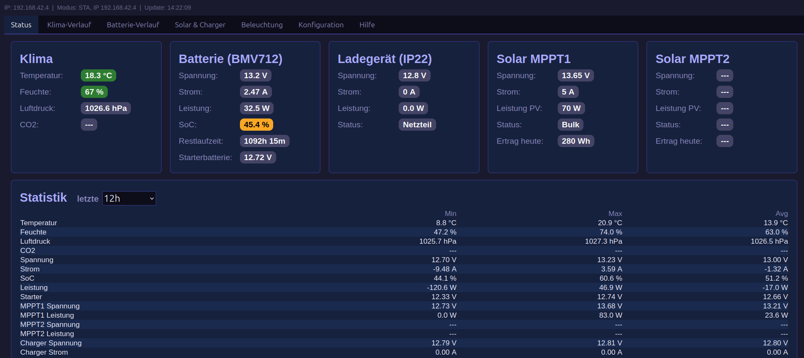
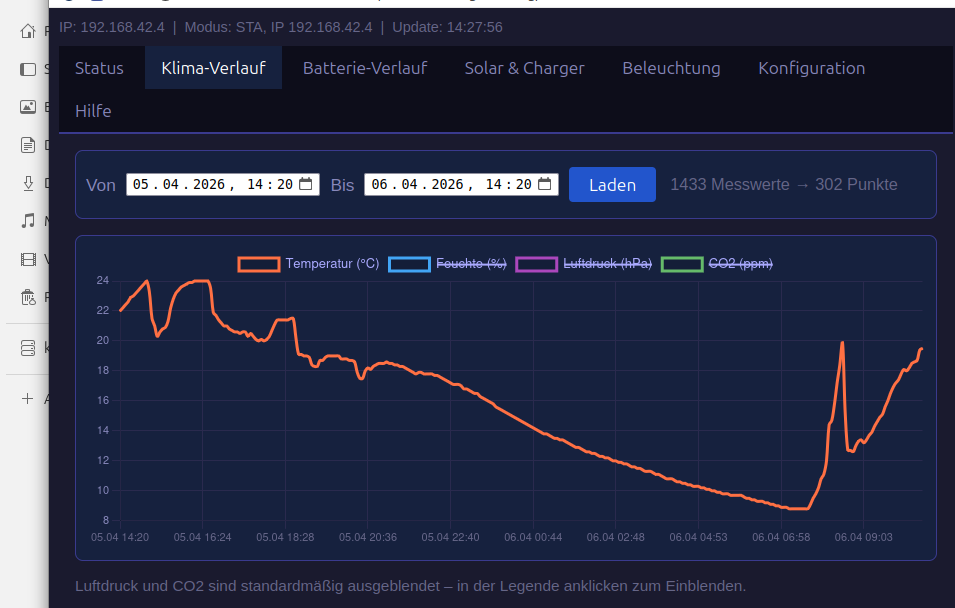
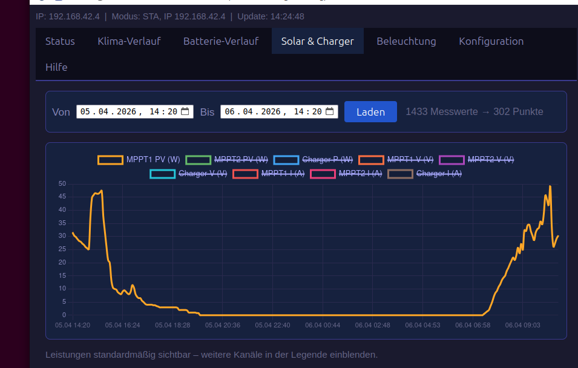
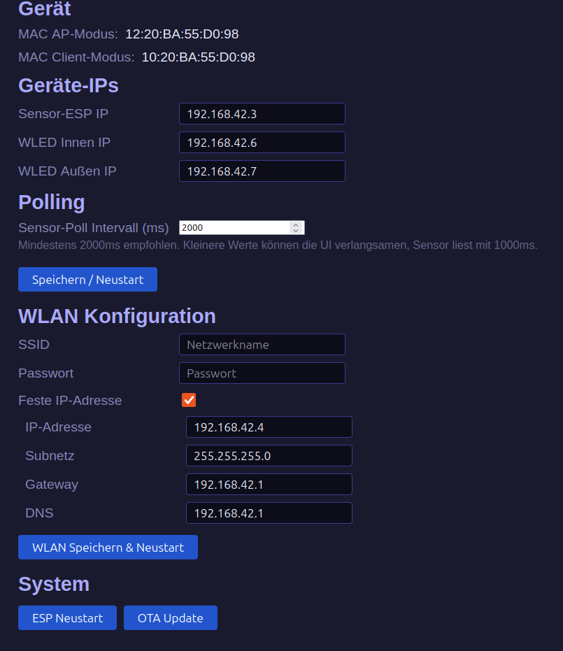
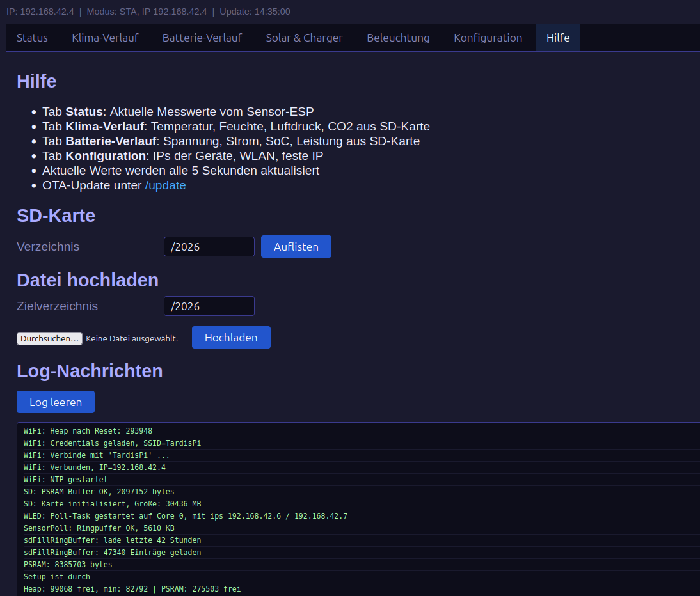

# ESP32 WoMo Monitor

A dual-ESP32 monitoring and control system for a motorhome / camper (Wohnmobil), providing real-time sensor data, battery monitoring, solar charge controller tracking, and lighting control via a touchscreen display and web interface.

## Why Two ESP32s?

The project uses two separate ESP32-S3 boards by design:

- **Display ESP32** (`ESP32WoMo`): Drives the 800×480 RGB touchscreen display using the `esp32_smartdisplay` framework. This board's display interface consumes significant resources and shares the I2C bus in a way that made running BLE and I2C sensors simultaneously unreliable. Bluetooth was intentionally excluded from this board to keep the display stable and responsive.

- **Sensor ESP32** (`sensor_esp`): Handles all BLE communication with Victron devices (BMV712, MPPT solar chargers, Blue Smart IP22 charger) as well as I2C sensors (BME280 for temperature/humidity/pressure). It exposes all data via a simple JSON HTTP API that the display ESP polls regularly.

This separation keeps responsibilities clean, avoids BLE/WiFi/display resource conflicts, and makes the system more robust.
Both systems are developed using platformio and claude for less typing and documentation reading. Both systems can be updated via OTA.

## Hardware

### Display ESP32 (ESP32WoMo)
- Board: ESP32-S3 with 800×480 RGB display (GT911 touch controller)
- SD card for data logging and history
- WiFi for web interface and NTP time sync
- Bluetooth devices from Victron (BMV 712, MPPT 75/15, IP22 Charger)

### Sensor ESP32 (sensor_esp)
- Board: ESP32-S3 DevKit
- **BME280**: Temperature, humidity, barometric pressure (I2C)
- **SCD41**: CO₂ sensor (I2C) — *not yet tested, driver prepared*
- **Victron BMV712**: Battery monitor via BLE
- **Victron MPPT (×2)**: Solar charge controllers via BLE
- **Victron Blue Smart IP22**: Battery charger via BLE

### Other ###
- WLED: LED lighting control (Innen/Außen) via WiFi/JSON API, two seperateesp8266 / esp32 running wled
- some led stripes
- voltage regulators to have stable 5V from Womo Lithium battery
- any kind of internet-acces for the ESP32-S3 Display, I've mounted a 4g router in the camper

## Features

### Display (LVGL 9)
- **Sensoren Tab**: Live climate and battery data with background images
- **Charger Tab**: Solar MPPT1, MPPT2 and IP22 charger data
- **Details Tab**: Statistics table (min/max/avg) for all sensors over selectable time periods
- **Beleuchtung Tab**: WLED lighting control with RGB sliders, color presets, brightness and power per zone
- Tab navigation via touch buttons (swipe disabled on lighting tab)


### Web Interface (of Display-ESP)
- **Status Tab**: Live sensor badges with color-coded warnings
- **Klima-Verlauf**: Climate history charts from SD card
- **Batterie-Verlauf**: Battery history charts from SD card
- **Solar & Charger**: Solar and charger history charts (MPPT1, MPPT2, IP22)
- **Beleuchtung**: Embedded WLED web interfaces (Innen/Außen) via iframe
- **Konfiguration**: IP addresses, WiFi settings, poll interval
- **Hilfe**: SD card file browser and log viewer

### Some screenshots of the WebInterface ###
Status


History (Temp)


History (Power MPPT1)


Config


Help/Log 


## Data Logging

All sensor data is written to the SD card every 60 seconds in CSV format:

```
Datum,Zeit,V,I,VS,SOC,TTG_min,P_W,T_C,H_pct,P_hPa,CO2_ppm,MPPT1_V,MPPT1_I,MPPT1_PV,MPPT2_V,MPPT2_I,MPPT2_PV,Charger_V,Charger_I,valid_flags
```

The `valid_flags` bitmask records which sensors were active at the time of writing, enabling accurate historical statistics even when sensors are occasionally unavailable (e.g. solar at night).

Old CSV files (12 fields, without MPPT/Charger/valid_flags) are still supported for reading.

## Ring Buffer

The display ESP maintains a ring buffer (in PSRAM)  of recent measurements for live statistics. Buffer capacity depends on the configured poll interval:

```
capacity (hours) = RING_MAX_ENTRIES × poll_interval_ms / 3600000
```

At the default 2000ms poll interval and 75600 entries (fixed), this gives approximately 42 hours of history. On startup, the ring buffer is pre-filled from the SD card.

## Configuration

Most settings are configurable and persistent via LittleFS:

| Setting | Default | Description |
|---|---|---|
| `sensor_esp_ip` | `192.168.42.3` | IP of the sensor ESP |
| `wled_innen_ip` | `192.168.42.6` | IP of indoor WLED |
| `wled_aussen_ip` | `192.168.42.7` | IP of outdoor WLED |
| `sensor_poll_interval_ms` | `2000` | How often to fetch sensor data (min 2000ms recommended) |

WiFi supports static IP with configurable gateway and DNS (not at sensor_esp, that one need no internet-access)

## Project Structure

```
ESP32WoMo/          ← Display ESP project (PlatformIO)
├── src/
│   ├── main.cpp
│   ├── ui_main.cpp
│   ├── ui_sensoren.cpp
│   ├── ui_charger.cpp
│   ├── ui_details.cpp
│   ├── ui_wled.cpp
│   ├── sensorpoll.cpp
│   ├── sdcard.cpp
│   ├── wifi.cpp
│   └── ...
├── include/
│   ├── lv_conf.h
│   ├── sensorpoll.h
│   └── ...
├── earthSmall.c        ← LVGL image (ARGB8888)
└── tardisSmall.c       ← LVGL image (ARGB8888)

sensor_esp/         ← Sensor ESP project (PlatformIO)
├── src/
│   ├── main.cpp
│   ├── victronble.cpp
│   ├── wifi.cpp
│   └── ...
└── lib/
    └── victronble/     ← Victron BLE library (modified)
```

<!--
## How to Add Screenshots

Place screenshot files in a `screenshots/` folder next to this README. Reference them in Markdown like this:

```markdown

```

Supported formats: `.png`, `.jpg`, `.gif`. GitHub renders them inline automatically.
-->
## Dependencies

### ESP32WoMo
- [esp32_smartdisplay](https://github.com/rzeldent/esp32-smartdisplay)
- LVGL 9
- ESPAsyncWebServer
- ArduinoJson
- ElegantOTA

### sensor_esp
- [VictronBLE](https://github.com/Sh3d/VictronBLE) (modified)
- ESPAsyncWebServer
- ArduinoJson
- ElegantOTA

## License

MIT, &copy; Karsten Römke (2026)
